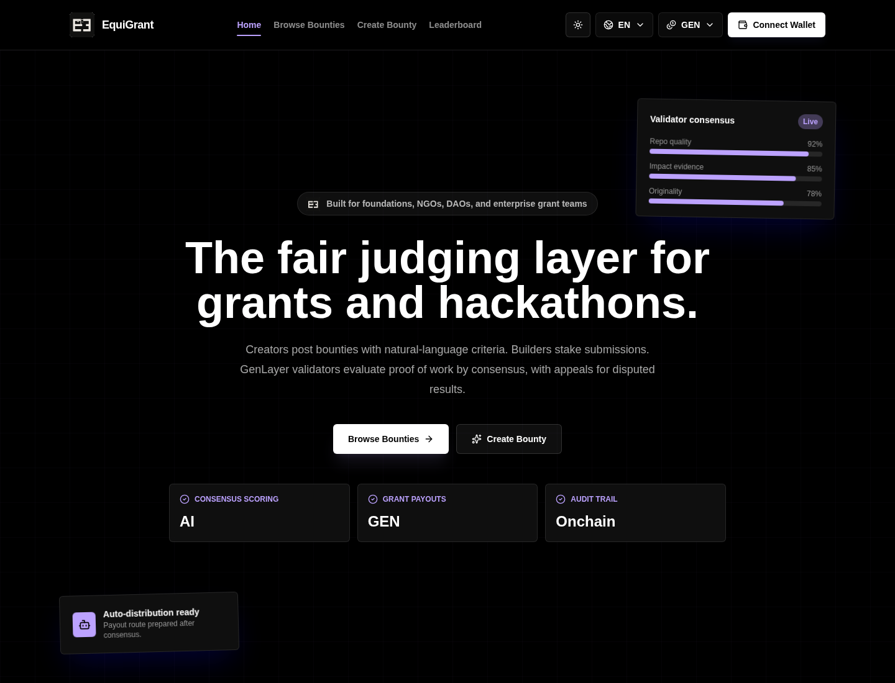
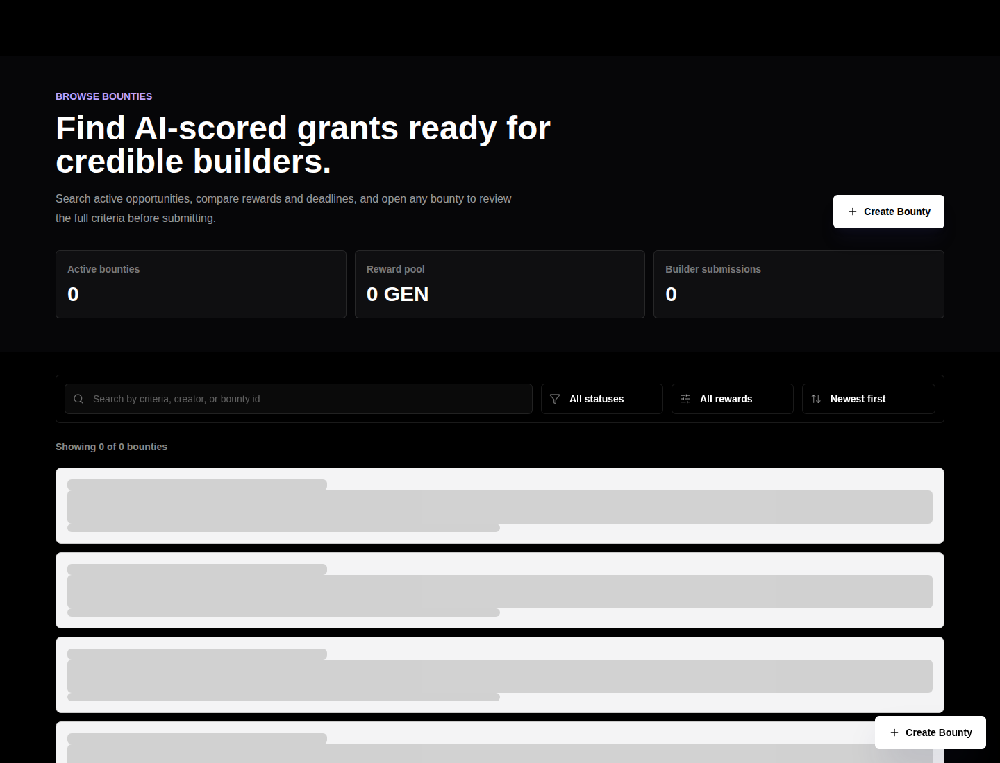
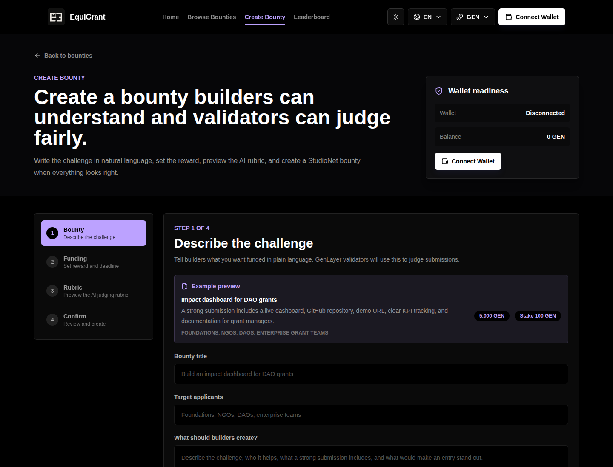
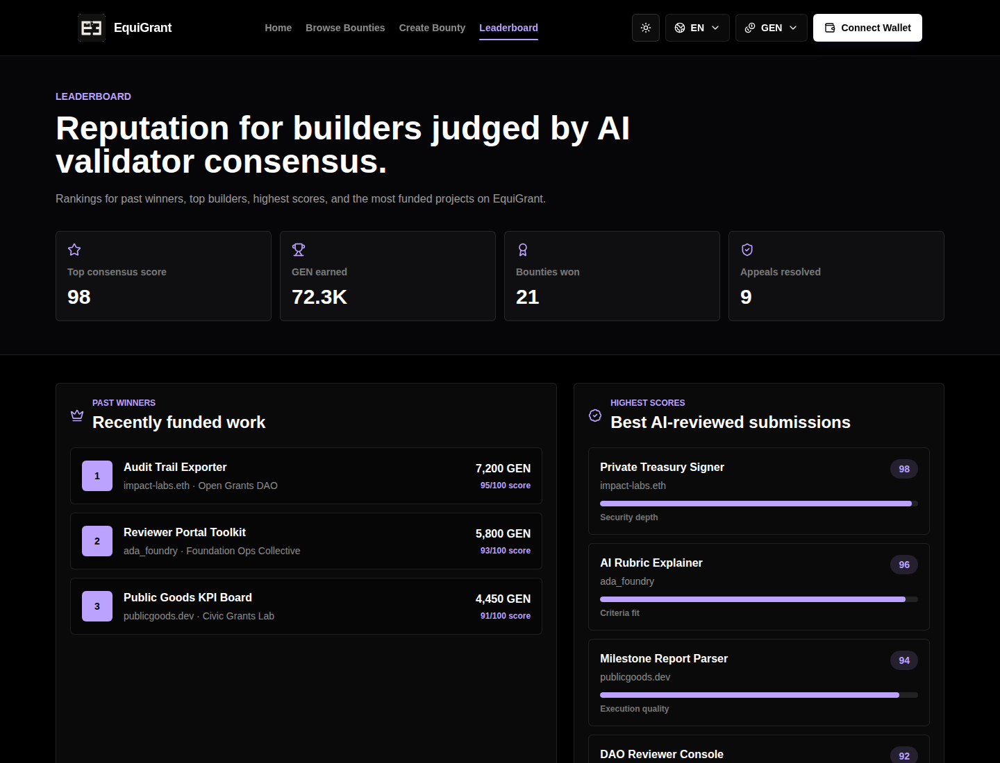

<p align="center">
  
</p>

<h1 align="center">EquiGrant</h1>

<p align="center">
  AI-governed grant infrastructure on GenLayer for foundations, NGOs, DAOs, and enterprise grant teams.
</p>

<p align="center">
  <a href="https://nextjs.org"></a>
  <a href="https://react.dev"></a>
  <a href="https://www.typescriptlang.org"></a>
  <a href="https://www.genlayer.com"></a>
</p>

<p align="center">
  <strong>The first AI-governed grant platform on GenLayer.</strong>
</p>



## Overview

EquiGrant is a production-grade MVP for AI-governed grants and bounties. Grant creators publish natural-language evaluation criteria and fund opportunities with GEN. Builders submit GitHub repositories, demo URLs, and project descriptions. GenLayer validators evaluate submissions through AI consensus and store the full lifecycle onchain.

The product is designed for real grant operations: creator dashboards, submitter dashboards, public bounty discovery, AI scoring, auditability, and lifecycle controls.

## Product Screens

| Browse bounties | Create bounty |
| --- | --- |
|  |  |

| Leaderboard | Live contract |
| --- | --- |
|  | `0xf18d43492210264D81506fA9d13ff84C125D3904` |

## Core Features

- Public landing page with premium GenLayer-aligned UI
- Bounty browsing with search, filters, sorting, status badges, rewards, deadlines, and AI scoring signals
- Bounty detail and submission flows
- Multi-step bounty creation wizard
- Creator-only Admin dashboard
- User dashboard for submissions, scores, reports, payments, appeals, and evaluation triggers
- Leaderboard for winners, builders, scores, and funded projects
- Browser wallet support through wagmi, viem, and RainbowKit
- GenLayer Python intelligent contract with onchain state
- Contract lifecycle actions: create, submit, evaluate, appeal, resolve, edit, pause, resume, extend, delete
- Full responsive coverage for desktop, tablet, and mobile

## Live Contract

| Network | Chain ID | Contract |
| --- | ---: | --- |
| GenLayer StudioNet | `61999` | `0xf18d43492210264D81506fA9d13ff84C125D3904` |

## Tech Stack

| Layer | Technology |
| --- | --- |
| Frontend | Next.js 14, React, TypeScript |
| Styling | Tailwind CSS, Framer Motion, lucide-react |
| Wallet | wagmi 2, viem 2, RainbowKit |
| Contract | GenLayer Python intelligent contract |
| Contract tests | genvm-lint, GenLayer direct-mode tests |
| Deployment | Vercel frontend, GenLayer CLI contract deployment |

## Architecture

```text
Builder / Creator Wallet
        |
        v
Next.js App Router UI
        |
        v
wagmi + viem + genlayer-js
        |
        v
EquiGrant Intelligent Contract
        |
        v
GenLayer AI Validator Consensus
```

All core application state lives on GenLayer. The frontend reads from the deployed contract and does not require an off-chain database.

## Quick Start

```bash
git clone https://github.com/mystiquemide/equigrant.git
cd equigrant

npm --prefix frontend ci
cp frontend/.env.example frontend/.env.local
npm run dev
```

Open [http://localhost:3000](http://localhost:3000).

## Environment

`frontend/.env.local`

```bash
NEXT_PUBLIC_GENLAYER_RPC_URL=https://studio.genlayer.com/api
NEXT_PUBLIC_GENLAYER_CHAIN_ID=61999
NEXT_PUBLIC_GENLAYER_EXPLORER_URL=https://genlayer-explorer.vercel.app
NEXT_PUBLIC_CONTRACT_ADDRESS=0xf18d43492210264D81506fA9d13ff84C125D3904
NEXT_PUBLIC_WALLETCONNECT_PROJECT_ID=
```

WalletConnect can stay empty for browser wallet testing. Add a Reown project id later for QR and mobile wallet support.

## Scripts

```bash
npm run dev
npm run lint
npm run build
npm run type-check
npm run lint:contracts
npm run test:direct
npm run verify
```

## Verification

Current local verification status:

| Check | Status |
| --- | --- |
| Frontend lint | Passed |
| Frontend build | Passed |
| TypeScript | Passed |
| GenVM lint | Passed |
| Direct contract tests | 23 passed |

## Vercel Deployment

See [docs/DEPLOYMENT.md](docs/DEPLOYMENT.md).

Recommended Vercel settings:

| Setting | Value |
| --- | --- |
| Framework | Next.js |
| Root directory | `frontend` |
| Install command | `npm ci` |
| Build command | `npm run build` |
| Output directory | `.next` |

## Repository Layout

```text
equigrant/
├── contracts/              # GenLayer Python intelligent contract
├── deploy/                 # Contract deployment helpers
├── docs/                   # Public deployment docs and README assets
├── frontend/               # Next.js application
├── tests/                  # Direct and integration contract tests
├── .github/workflows/      # CI pipeline
└── README.md
```

## License

MIT. See [LICENSE](LICENSE).

## Contributing

See [CONTRIBUTING.md](CONTRIBUTING.md) for local setup, verification, branch naming, and contract contribution rules.

## Security

See [SECURITY.md](SECURITY.md) for vulnerability reporting and pre-deploy security checks.

## Changelog

See [CHANGELOG.md](CHANGELOG.md) for release notes.
